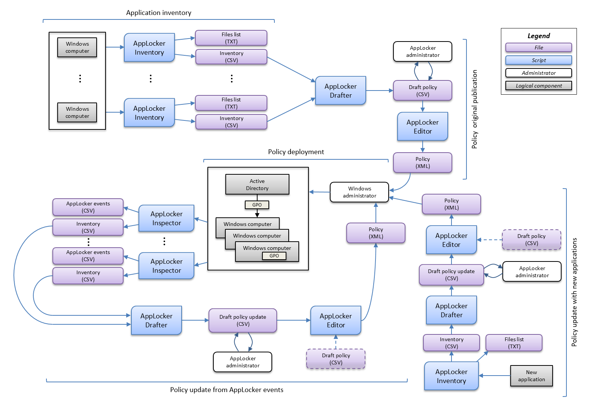

# AppLocker Deployment Scripts

### Overview

The scripts can be used to build up and maintain an AppLocker policy.

They help to:
* quickly inventory applications on computers,
* edit an AppLocker policy that can be imported into an AppLocker GPO,
* easily maintain the policy with new applications.

**Warning**

Those scripts could be used to quickly build up a custom policy. However, they are just tools and a human validation must be carried out carefully.

### Description

#### Glossary

| Word       | Definition                                                                                           |
|------------|------------------------------------------------------------------------------------------------------|
| Inventory  | A CSV file of AppLockerFileInformation data (path, publisher, hash, etc.)                            |
| Draft      | A CSV file of publisher based and hash based rules                                                   |
| Policy     | An AppLocker XML policy file                                                                         |
| Inspection | A CSV file of AppLocker EventID                                                                      |

#### Scripts

**AppLockerInventory.ps1** 

It lists files on computer/folder and executes cmdlet "Get-AppLockerFileInformation" on listed files. 

By defaut a full computer scan is performed (list files on each computer drives). A folder scan can be used in order to update policy with a new application (list files contained in folder).

The script should be run with admin rights.

**AppLockerDrafter.ps1**

It creates a list of publisher based and hash based rules from an inventories list.

**AppLockerEditor.ps1**

It creates a XML policy from drafts. The policy can be imported into an AppLocker GPO.

The default enforcement mode is "AuditOnly".

**AppLockerInspector.ps1**

It reads AppLocker events on a computer. For 'not allowed to run' files or 'would have been prevented from running' files (EventId 8003, 8004, 8006 and 8007), the cmdlet "Get-AppLockerFileInformation" is executed. The result can be used to complete the initial policy.

If a file has been deleted between event time and information collection time, the script may not be able to get AppLockerFileInformation data.

**Setup.ps1**

It sets up folders structure.

Folder structure:
* Inventories: Inventories may be dropped here.
* Drafts: By default, drafts files are created here.
* Policies: By default, policy files are created here.
* Inspections: Events files may be dropped here.

#### Deployment process

### Example

See [here](EXAMPLE.md "Example")

### Requirements

Powershell AppLocker module.

### Reminders about AppLocker

Don't forget to:
* activate the AppIDSvc service,
* increase the maximum log size,
* monitor AppLocker events for security reasons and end-user needs.

